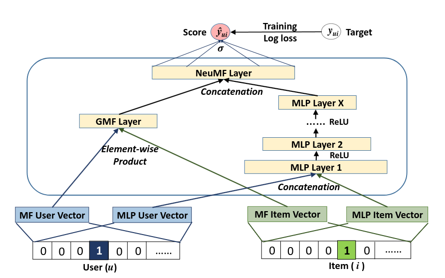
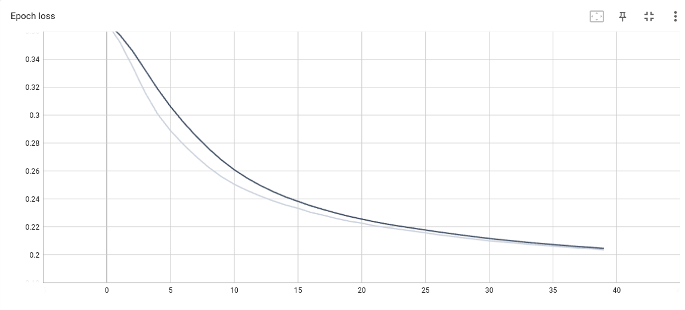
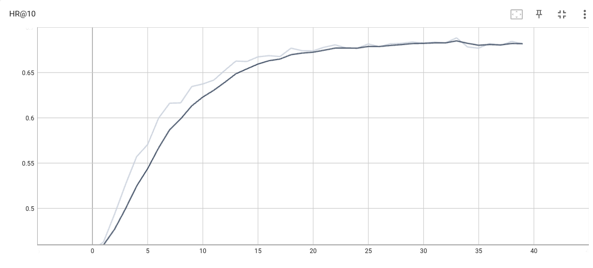
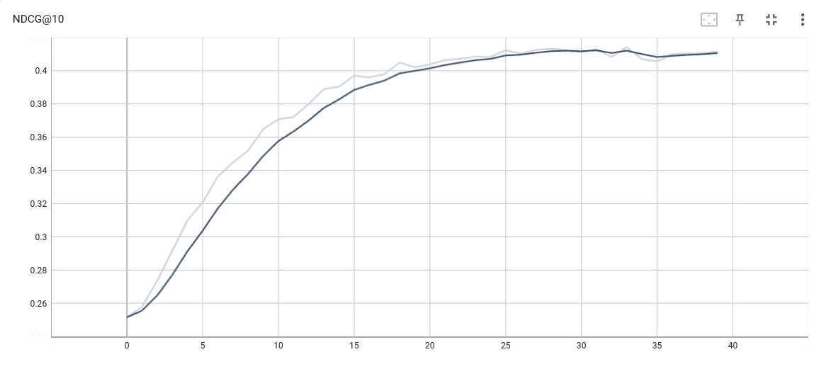

# Recommendation-System

A Movie Recommendation System implementation for the course CS 328: Data Science

## Neural Collaborative Filtering

Based on the paper:
```
He, Xiangnan, et al. "Neural collaborative filtering." Proceedings of the 26th international conference on world wide web. 2017.
```

Dataset used: MovieLens-1M

### Model Architecture:

<figure align = "center">
    
    <figcaption align = "center">
        <b>Architecture of The Neural Matrix Factorization (NeuMF) Model</b>
    </figcaption>
</figure>

<!--  -->


### Learning Curves

Epoch Loss
<figure align = "center">
    
</figure>

Hitrate@10
<figure align = "center">
    
</figure>

NDCG@10
<figure align = "center">
    
</figure>
